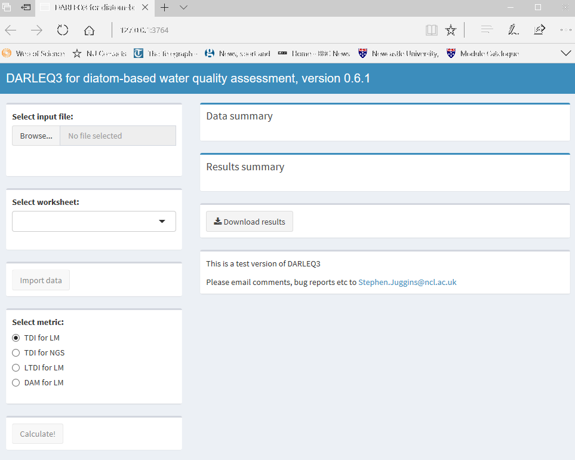
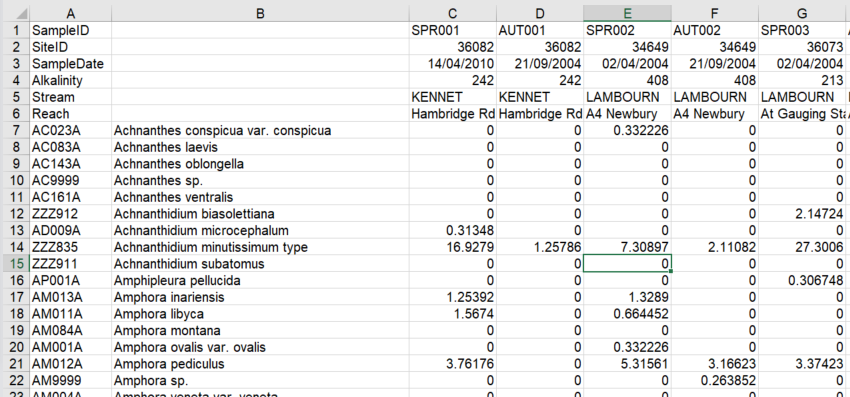
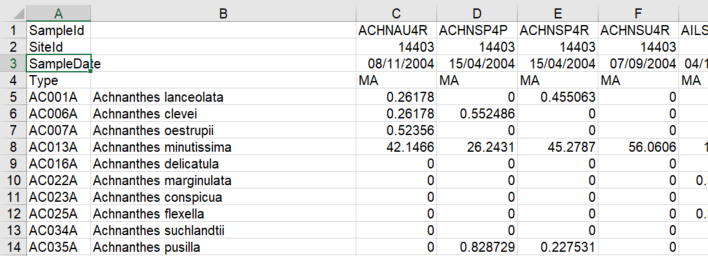

<!--
  %\VignetteIndexEntry{`darleq3: User Guide Version`}
  %\VignetteEngine{knitr::rmarkdown}
  %\VignetteEncoding{UTF-8}
-->

<style type="text/css">
pre {
  font-size: 9pt;
}
code.r {
  font-size: 12pt;
}
body{
  font-family: Calibri;
  font-size: 12pt;
}
</style>

```{r setup1, include=FALSE}
knitr::opts_chunk$set(out.width="100%", warning=FALSE, prompt=TRUE)
knitr::opts_chunk$set(cache=TRUE, fig.path="R_Figures/", cache.path="Cache/")
options(width=120)
library(darleq3)
```

## 1. Introduction

`darleq3` is an R package for the assessment of river and lake ecological status using diatom data obtained by light microscopy (LM) or Next Generation Sequencing (NGS). The package contains functions to import diatom and associated environmental data from Excel worksheets, perform simple data validation checks, calculate various water quality metrics, EQRs and Water Framework Directive (WFD) quality classes for samples, and clafficiation uncertainty for sites.  The package can calculate Trophic Diatom Index TDI5LM, TDI4 and TDI3 scores for light miscroscopy river diatom samples, TDI5NGS for NGS river diatom samples, Lake Trophic Diatom Index LTDI2 and LTDI1 scores for light miscrscopy lake diaotm samples, and Diatom Acidification Metric (DAM) scores for lake and river light microscopy samples. Details of the TDI / LTDI metrics, algorithm and derivation of the status class boundaries for rivers are given in Kelly _et al_. (2008) and for lakes in Bennion _et al_. (2014). Details of the DAM acidification metric is described in Juggins _et al_. (2016). Calculation of uncertainty of classification is described in Kelly _et al_. 2009.

`darleq3` can be run in two ways, either as an interactive shiny app, or a a series of R functions issues from the R console or an R script.  The first method attempts to mimic the old DARLEQ2 software will be the easiest for most users. The second methods will be more convenient for processing multiple data sets, for automating darleq calculations, or including them in a longer chain of analysis.

## 2. Installation

The easiest way to install `darleq3` is from a github repository. To do this first install the package `devtools` with the following command, omitting the prompt ("> "):

```{r devtools, eval=FALSE}
install.packages("devtools")
```

Then install `darleq3`. Note that this will also automatically install some additional packages on which `darleq3` depends.

```{r github, eval=FALSE}
library(devtools)
install_github("nsj3/darleq3", build_vignettes=TRUE)
```

`darleq3` also contains an example Excel data file.  This can be made available in a R session with the following:

```{r example, eval=FALSE}
library(darleq3)
fn <- system.file("example_datasets/DARLEQ2TestData.xlsx", package="darleq3")
```

The file can be opened in Excel usingt he following:

```{r Excel, eval=FALSE}
# note running the following lines will open the file in Excel (if installed)
shell.exec(fn)
```

## 3. Using the `darleq3` Shiny app

`darleq3` can run on a remote Shiny server or locally on a desktop PC running RStudio.  The app will function in exactly the same way in both situations.  To run `darleq3` on a remote shiny server open a web browser and point it to either:

https://nsj3.shinyapps.io/darleq3/  

http://gpsgpuserver.ncl.ac.uk:3838/darleq3/

Both these hosts have been set up for testing purposes and may change.  There may be problems running the app on the second server listed from within the EA.  

To run the app locally, simply start RStudio, load the `darleq3` package and run the command `runDARLEQ()`:

```{r shiny, eval=FALSE}
library(darleq3)
runDARLEQ()
```

This should open a browser and display the DARLEQ3 shiny app.

 

To use the app follow these simple steps:

* 1: Click the Browse... button to select and upload a DARLEQ diatom file (see below).

* 2: Once uploaded, select a sheet and click import.  A summary (number of samples & taxa) will be displayed in the Data summary box when upload is complete.

* 3: Select the metric type. "TDI for LM" will calculate TDI3, TDI4 and TDI5LM for river LM diatom data, TDI for NGS will calculate TDI5NGS for river NGS diatom data, "LTDI for LM" will calculate LTDI1 and LTDI2 for lake LM data, and "DAM for LM" will calculate the diatom acidification metric for river LM data.  A summary of results will appear in the Results summary box when the calculations are complete.

* 4: Click Download Results to save the results in an Excel file.  The default name for this file will be the "DARLEQ3_Results_" concatenated with the original data filename, worksheet name, and date.

To quit the app simple close the browser and or hit Escape in the RStudio Console window.

## 4. Using the `darleq3` R package

`darleq3` contains a number of functions for importing diatom data, calculating various sample and site-based metrics, EQRs and WFD quality classes, and saving the results in Excel format.  The main functions are:

* `darleq` import diatom data from an Excel file, calculate matrics, EQRs and WFD quality classes, and save results in Excel format
* `read_DARLEQ` import diatom data from an Excel file
* `save_DARLEQ` save metric and EQR results in an Excel file
* `calc_Metric_EQR` calculate EQRS, WFD quality classes and summary diagnostic measures for multiple metrics
* `calc_Metric` calculate various diatom water quality metrics
* `calc_EQR` calculate sample and site EQRs and WFD quality classes
* `runDARLEQ` run DARLEQ3 as an interactive shiny app in a web browser

type ?function_Name at the R prompt to get help and example useage for these functions.

The `darleq3` functions have been designed to allow the user to perform individual steps of the data analysis sequence individually, for example importing diatom data, calculating a particular metric diatom from LM or NGS diatom data, or calculating EQRs from a metric and site information. These low-level functions are useful for embedding darleq3 in a longer data analysis chain using R.  The package also includes "wrapper" functions, that "wrap" multiple low-level functions to perform a complete analysis with a single function call.  

### 4.1 `darleq3` wrapper functions

The most useful wrapper function is `darleq`.  This function imports data form an Excel file, calculates multiple metrics, EQRs and WFD classes and saves the results to another Excel file in one step.  

```{r darleq, eval=FALSE}
fn <- system.file("example_datasets/DARLEQ2TestData.xlsx", package="darleq3")
darleq(fn)
```

`darleq` will, by default, import data from the first sheet in the Excel file, and calculate TDI3, TDI4 and TDI5LM.  If the output filename is not given the function will generate a name by concatenating "DARLEQ3_Results_" with the original filename, the sheet name and the current date.  

To specify the sheet name, a different metric, and a output file name:

```{r darleq2, eval=FALSE}
fn <- system.file("example_datasets/DARLEQ2TestData.xlsx", package="darleq3")
darleq(fn, sheet="Lakes LTDI Test Data", metrics="LTDI2", outFile="Results.xlsx")
```

To calculate and save results for multiple metrics:

```{r darleq3, eval=FALSE}
fn <- system.file("example_datasets/DARLEQ2TestData.xlsx", package="darleq3")
darleq(fn, sheet="Lakes LTDI Test Data", metrics=c("LTDI1", "LTDI2"), outFile="Results.xlsx")
```

### 4.2 `darleq3` low-level functions

`darleq3` low-level functions are useful for calculating partial results or for embedding darleq3 in a longer data analysis sequence.  The key functions are `read_DARLEQ` to import data from a DARLEQ-formatted data file (see Section 6 below for guidelines on how to format the data correctly).  `read_DARLEQ` returns a list with two elementss: `diatom_data` - a data frame of the diatom count or relative abundance data, and `header` - a data frame of sample, site and environmental data from the header of the Excel file.

```{r read}
fn <- system.file("example_datasets/DARLEQ2TestData.xlsx", package="darleq3")
d <- read_DARLEQ(fn, "Rivers TDI Test Data")
head(d$diatom_data[, 1:8])
head(d$header)
```

`calc_Metric_EQR` calculates one or more diatom metrics and the corresponding sample and site EQRS and WFD classes, and class uncertainties.  The function returns a list with an element for each metric.  Each element is itself a list containing sample EQRs, site EQRs and uncertaintues and a job summary.

```{r meqr}
fn <- system.file("example_datasets/DARLEQ2TestData.xlsx", package="darleq3")
d <- read_DARLEQ(fn, "Rivers TDI Test Data")
results <- calc_Metric_EQR(d, metrics=c("TDI4", "TDI5LM"))
head(results$TDI5LM$EQR[, 9:15])
head(results$TDI5LM$Uncertainty)
```

`save_DARLEQ` saves the output from `calc_Metric_EQR` in an Excel file:

```{r save, eval=FALSE}
fn <- system.file("example_datasets/DARLEQ2TestData.xlsx", package="darleq3")
d <- read_DARLEQ(fn, "Rivers TDI Test Data")
results <- calc_Metric_EQR(d, metrics=c("TDI4", "TDI5LM"))
save(results, outFile="Results.xlsx")
```

`calc_Metric` calculates a single metric from a data frame of diatom count or relative abundance data.

```{r metric}
fn <- system.file("example_datasets/DARLEQ2TestData.xlsx", package="darleq3")
d <- read_DARLEQ(fn, "Rivers TDI Test Data")
x <- calc_Metric(d$diatom_data, metric="TDI4")
head(x$Metric)
```

`calc_EQR` calculates sample and site EQRS and WFD classes, and class uncertainties from a list of sample metrics.

```{r eqr}
fn <- system.file("example_datasets/DARLEQ2TestData.xlsx", package="darleq3")
d <- read_DARLEQ(fn, "Rivers TDI Test Data")
x <- calc_Metric(d$diatom_data, metric="TDI4")
eqr <- calc_EQR(x, d$header)
head(eqr$EQR[, 9:15])
head(eqr$Uncertainty)
```

## 5. Understanding `darleq3` output

The DARLEQ shiny app and R functions produce output that is similar in structure and content to that produced by the DARLEQ2 program. Specifically, the shiny app and functions `darleq` and `save_DARLEQ` save data in an Excel file with the following content. For each metric, the output file will contain 3 worksheets, named Code_Job_Summary, and Code_Uncertainty (where Code is the code for each metric).  These three sheets contain the following information:

### 5.1 Job summary 

This sheet contains the input file name, worksheet name and a summary of the number of samples and taxa in the file.  It also contains a list of taxa included in the file but exclused from the metric calculations either because they are planktic or because they are not included in the DARLEQ list of indicator values for that metric.  The list also caons the number of occurennces (N), Hill's N2 effective number of occurrences (Hill 1973) and maximum abundance of these taxa.  The list of useful in checking the data for coding errors to identify abundant taxa excluded from the metric calculations.

### 5.2 Sample_Summary

Sample Summary – this sheet contains metric, EQR and quality class results for each sample.  First, the sample information listed in the original input file is repeated, and then results of the analysis are listed as follows (where CODE is the metric Code):

* Total_count: 	Sum of the counts or percentages of all taxa in a sample.

Percent_in_CODE: 	Percentages of the total count of taxa that are matched to taxa in the master taxon list and included in the metric calculations.  If all taxa are matched this will be the same as the Total_count but will be less if, for example, planktic taxa are present.  Comparison of these two fields will indicate if there are important taxa present in the sample but not included in the status calculations.

* N_CODE, N2_CODE, Max_CODE: Number of taxa (N), effective number of taxa (N2) and maximum abundance (max) of taxa included in the metric calculations.

* CODE: value of the metric for each sample.

* eCODE:	Expected vaklue of the metric for each sample according to typology (lakes) or site-specific prediction (rivers).

* EQR_CODE:	EQR for each sample based on predicted and observed metrics.

* Class_CODE:	Status class based on EQR.

After the metric and classification fields a series of summary fields are listed containing the percentage of various ecological groups of diatoms:

* Motile:	Percentage of the motile diatoms in the sample.

* OrganicTolerant:	Percentage of organic pollution tolerant diatoms in the sample. 

* Planktic:	Percentage of planktic diatoms in the sample. These are excluded from the status calculations.

* Saline:	Percentage of diatoms tolerant of slightly saline waters. 

* Comments:	List of any warning messages generated during calculations for individual samples relating to missing or out-of-range environmental values.

For TSI4 the following coulms are also included:

* TDI4.D2.Sum: Sum of taxa included in DARLEQ version 2 TDI4 calculations

* TDI4.D2: TDI4 calculated using DARLEQ version 2 taxon list and indicator values

* TDI4.Diff: Difference in TDI4 calculated using DARLEQ version 3 and 2 taxon lists and indicator values

* TDI4.D2.EQR: EQR for DARLEQ version 2 TDI4

* TDI4.D2.Class: Status class for DARLEQ version 2 TDI4

* Class.Diff: Indication if there is a difference in DARLEQ version 2 and 3 TDI4 status class


### 5.3 Uncertainty

Multiple samples from each site are combined and an uncertainty analysis is performed using the mean EQR and number of samples according to Kelly _et al_. (2009):

* SiteID:	Unique site code taken from row 2 of the input data. 

* N: Number of samples for site used in calculation of mean EQR and CoC. 

* EQR:	Mean EQR for each site. 

* lake_TYPE: lake type (only for lake data)

* WFDClass:	Status class based on mean EQR.

* CoCH - CoCB:	Confidence that the site belongs to status class high, good, etc.

* RoM: Risk of misclassification for predicted class.

* CoCHG:	Confidence that the site is better than moderate class.

* CoCMPB:	Confidence that the site is moderate or worse class.

* RoM_GM:	Rick of misclassification above / below the good / moderate boundary.


## 6. Input data format

`read_DARLEQ` and the shiny app import diatom data from an Excel file in either .xls or .xlsx format.  An example Excel file is included in this package (see Section 2 on how to view it).  The required data and layout are rather and are slightly different for river and lake samples.  Figure 2 below shows the required format for performing TDI calculations for river samples.

The first four header rows are mandatory and must contain the following information:

* Row 1: SampleID:  a short numerical or alphanumeric code to uniquely identify the sample. This field cannot be empty (an empty cell indicates the end of data).

* Row 2:	SiteID – a short numerical or alphanumeric code to uniquely identify the site. This code will be used to aggregate multiple samples when calculating confidence of class for a site.

* Row 3:	SampleDate: sample date in Day/Month/Year format. Missing dates are set to Spring for the purposes of classification using TDI3 and samples flagged with a warning.
 
* Row 4:	Alkalinity: Mean annual alkalinity (or best available estimate) in mg l-1 (CaCO3). Missing values are set to 100 mg l-1 for the purposes of classification and samples flagged with a warning.  Alkalinity values outside the range of the site prediction algorithm are set to the appropriate limit (6 or 150 mg l-1 for TDI3 and 5 or 250 mg l^-1 for TDI4 and TDI5LM / TDI5NGS).

* Rows 5+: Further option sample descriptors such as river name, reach name etc. These data are not used by the program but will be reproduced in the output.

Note that the second column of the header information must be left blank.

 

Identifiers for each row of the sample header information should be listed in column 1.  Diatom data then follow the header information and may be in count or percentage format. The first column must contain the taxon code in either NBS or DiatCode (http://www.ecrc.ucl.ac.uk/?q=databases/diatcode) format. The codes in this column are used to link the data to the DARLEQ3 taxon list and ecological information and cannot be empty (an empty cell indicates the end of the data). The second column must include either the taxon name or code (ie. a repeat of column 1).  

The remaining columns to the right of the taxon name contain diatom counts or percentages.  Empty (blank) cells in the matrix will be read as zero. Character data in the diatom matrix will generate an error. A full list of diatom codes (either NBS or DiatCodes) are available in the dataframe `darleq3_taxa`.

If the Diatom Acidification Metric (DAM) is to be calculated, the header must contain estimates of mean annual Calcium and DOC concentrations, rows named Calcium and DOC, and in ueq l-1 and mg l-1 respectively. Figure 3 shows an example formatted for calculation of TDI and DAM.  Note that if only DAM scores are required the Alkalinity field may be left blank.  Sample Date is not used for calculating DAM and may be left blank.

 

The required input format for lake samples is shown in Figure 4. This is exactly the same as for river data except that the fourth row must be named LAKE_TYPE and contain a code indicating lake type according to the GB lake typology alkalinity classes.  Marl lakes are included in the high alkalinity (HA) group. Peat and brackish lakes are not covered by the tool.  Sample date for lake samples is not used in the class calculations and can contain missing values.

 

## 7. Acknowledgements


## 8. References

Bennion, H., Kelly, M.G., Juggins, S., Yallop, M.L., Burgess, A., Jamieson, J., Krokowski, J., 2014. Assessment of ecological status in UK lakes using benthic diatoms. _Freshwater Science_ __33__, 639-654.

Juggins, S., Kelly, M., Allott, T., Kelly-Quinn, M., Monteith, D., 2016. A Water Framework Directive-compatible metric for assessing acidification in UK and Irish rivers using diatoms. _Science of The Total Environment_ __568__, 671-678.

Kelly, M., Bennion, H., Burgess, A., Ellis, J., Juggins, S., Guthrie, R., Jamieson, J., Adriaenssens, V., Yallop, M., 2009. Uncertainty in ecological status assessments of lakes and rivers using diatoms. _Hydrobiologia_ __633__, 5-15.

Kelly, M., Juggins, S., Guthrie, R., Pritchard, S., Jamieson, J., Rippey, B., Hirst, H., Yallop, M., 2008. Assessment of ecological status in UK rivers using diatoms. _Freshwater Biology_ __53__, 403-422.
